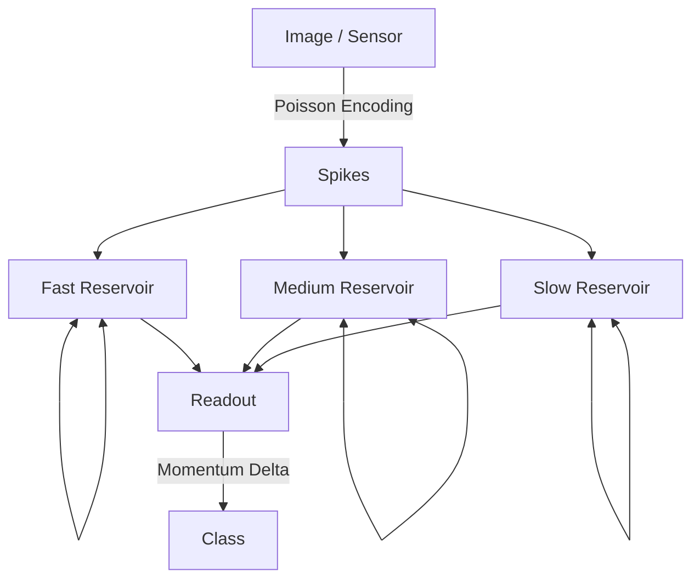

# **SARA Engine (Liquid Harmony)**

**SARA (Spiking Advanced Recursive Architecture)** is a next-generation AI engine (SNN-based) that mimics the biological brain's "power efficiency, event-driven processing, and self-organization."

It completely eliminates the "backpropagation (BP)" and "matrix operations" that modern deep learning (ANNs) rely on, achieving advanced recognition and learning capabilities using **only sparse spike communication**.

It operates on CPU only, without using any GPU.

Current Version: **v35.1 (Code Name: Liquid Harmony)**

## **Features**

* **No Backpropagation**: Learns without error backpropagation, using local learning rules (Momentum Delta) and reservoir computing.
* **CPU Only & Lightweight**: Does not require expensive GPU resources. Runs fast on standard CPU environments.
* **Multi-Scale True Liquid Reservoir**: Three parallel reservoir layers with different temporal characteristics (Decay), with recurrent connections within each layer. Achieves short-term memory using information "echo."
* **Sleep Phase**: Implements a "sleep phase" between learning epochs to physically prune unnecessary synapses, preventing overfitting.

## **Installation**

```bash
pip install sara-engine
```

## **Quick Start**

```python
from sara_engine import SaraEngine

# 1. Initialize the engine (input: 784, output: 10 classes)
engine = SaraEngine(input_size=784, output_size=10)

# 2. Prepare data (Poisson-encoded spike train)
# spike_train = [[neuron_idx, ...], [], [neuron_idx], ...]
# ... (See examples/train_mnist.py for data preparation details)

# 3. Training (No GPU required, runs on CPU)
# target_label: index of the correct class
engine.train_step(spike_train, target_label=1)

# 4. Inference
prediction = engine.predict(spike_train)
```

## **Architecture (v35.1)**

SARA mimics the cortical structure of the brain and has three Reservoir layers:

| Layer Type | Neuron Count | Decay Rate | Role | Recurrent Connection Strength |
|:-----------|:-------------|:-----------|:-----|:------------------------------|
| **Fast** | 1,500 | 0.3 (Fast) | Edge detection, noise processing | 1.2 (Medium) |
| **Medium** | 2,000 | 0.7 (Medium) | Shape and stroke integration | 1.5 (Strong) |
| **Slow** | 1,500 | 0.95 (Slow) | Context and global pattern retention | 2.0 (Strongest) |

### **Processing Flow**



## **Recommended Parameters (Best Practice)**

Golden ratios for MNIST tasks:

* **Samples**: 20,000 (minimum baseline)
* **Reservoir Size**: 5,000 neurons (Fast: 1500, Med: 2000, Slow: 1500)
* **Input Scale**: Strong input to Fast layer (1.0), weak input to Slow layer (0.4)
* **Sleep Pruning**: 5% (recommended to execute every epoch)

## **How to use**  
  
To use these new engines, call them as follows:  
STDP pre-training example:  
  
bash```
from sara_engine import STDPSaraEngine

# Initialize the STDP engine  
engine = STDPSaraEngine(input_size=784, output_size=10)

# 1. Unsupervised pre-training (no labels required)
# spike_data_list = [spike_train1, spike_train2, ...]
engine.pretrain(spike_data_list, epochs=1)

# 2. Supervised fine-tuning 
for spikes, label in labeled_data:
    engine.train_step(spikes, label)
```    
  
Example of a hierarchical engine:   
  
bash```
from sara_engine import HierarchicalSaraEngine

# Initialize Deep SNN  
deep_engine = HierarchicalSaraEngine(input_size=784, output_size=10)

# Learn as usual  
deep_engine.train_step(spike_train, label)
```  

## **License**

MIT License